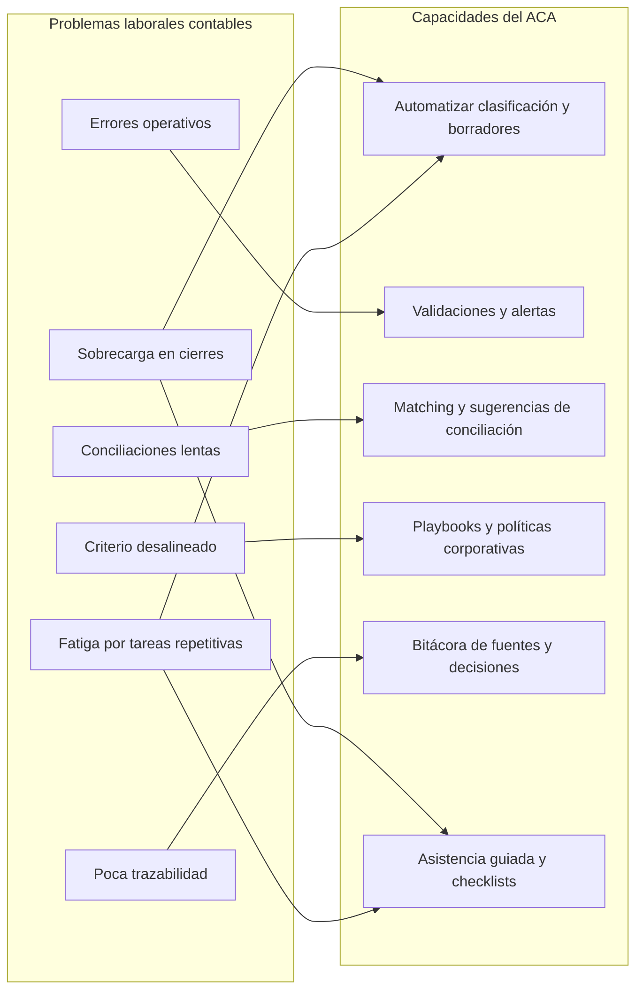
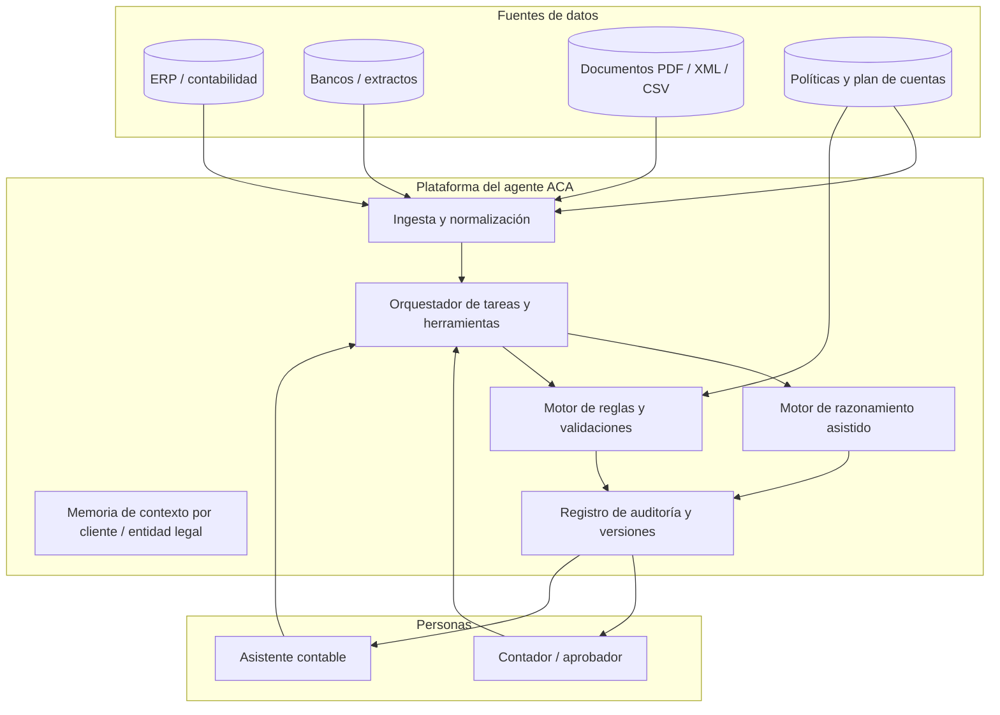
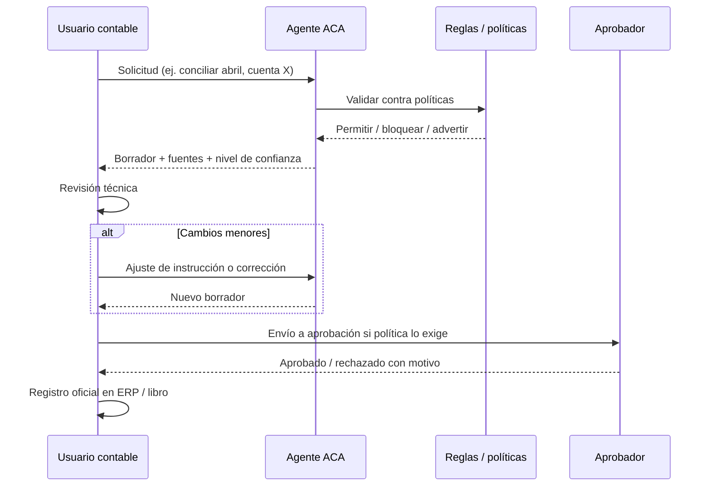
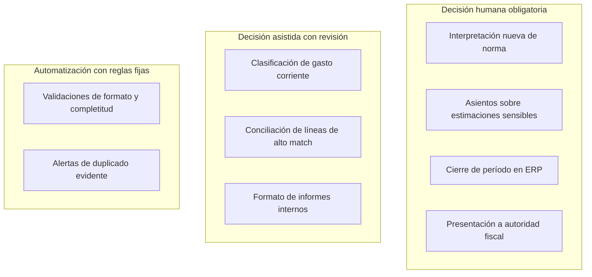
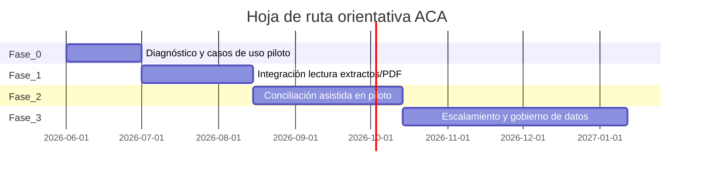

# Documento de proyecto — Agente Contable Asistente (ACA)

| Campo | Valor |
|--------|--------|
| **Nombre del proyecto** | Agente Contable Asistente (ACA) |
| **Tipo de documento** | Ficha de proyecto / marco de referencia |
| **Versión** | 1.1 |
| **Audiencia** | Dirección financiera, contaduría, TI, cumplimiento, proveedores del agente |

---

## 1. Resumen ejecutivo

El **Agente Contable Asistente (ACA)** es una solución basada en agente inteligente diseñada para **acompañar al contador** en su jornada laboral: reduce tareas repetitivas, acelera conciliaciones y clasificaciones, unifica criterios en el equipo y deja **trazabilidad** de cada propuesta antes de que el profesional valide o rechace.

El proyecto responde a **problemas laborales concretos del ejercicio contable** (sobrecarga en cierres, errores operativos, retrabajo, dispersión de fuentes y fatiga cognitiva), sin sustituir el juicio profesional ni la responsabilidad legal de quien firma estados o declaraciones.

**Resultado esperado:** más horas disponibles para análisis, auditoría interna de calidad y atención a cliente o a negocio; menos tiempo en digitación, búsqueda manual y formateo de informes preliminares.

---

## 2. Título del proyecto

**Agente Contable Asistente (ACA)** — *Copiloto inteligente para contadores y equipos de finanzas.*

---

## 3. Descripción del proyecto

### 3.1. Qué es

ACA es un **agente de software** (orquestación + modelos de lenguaje y/o reglas) que:

- **Lee e interpreta** documentos contables y financieros (extractos, facturas, comprobantes, políticas internas, plan de cuentas, historial de asientos tipo).
- **Propone** clasificaciones de gastos/ingresos, cuentas contables, textos de asiento, notas explicativas y borradores de conciliación banco–libros.
- **Detecta** anomalías (doble registro, saltos de secuencia, montos fuera de rango, proveedores nuevos sin alta, períodos cerrados).
- **Documenta** el razonamiento resumido y las fuentes usadas para que la revisión humana sea rápida y defendible ante auditoría.

Opera bajo el principio **humano en el circuito (human-in-the-loop)**: las salidas críticas son **borradores** hasta aprobación explícita del contador o del rol delegado.

### 3.2. Para quién es

| Perfil | Valor principal |
|--------|------------------|
| **Contador público / estudio** | Estandarizar trabajo de cartera, reducir plazos de entrega, plantillas de revisión por cliente. |
| **Contador interno / controller** | Cierres más predecibles, menos retrabajo entre áreas, registro uniforme de criterios. |
| **Analista / asistente contable** | Guía en la primera clasificación, checklist de completitud, menos consultas repetidas al senior. |
| **Auditoría interna** | Trazas de qué se propuso, por qué y quién aprobó. |

### 3.3. Qué no es (límites explícitos)

- No es **sustituto** del contador certificado ni de la firma de estados financieros.
- No **decide** solo sobre interpretaciones normativas complejas sin marco aprobado por la organización.
- No debe **enviar** declaraciones a autoridades ni **cerrar** períodos contables en ERP sin flujo de aprobación definido.
- No reemplaza **asesoría legal laboral** (contratos, despidos, negociación colectiva); si el agente incorpora módulos de RR.HH. contable (nómina, provisiones), esas reglas las define la empresa con asesoría especializada.

---

## 4. Problema de negocio y encaje laboral

### 4.1. Dolores laborales que el proyecto ataca

1. **Picos de carga** en fin de mes, trimestre y ejercicio.  
2. **Errores** por digitación manual, copiar/pegar entre Excel y ERP, versiones desincronizadas de archivos.  
3. **Conciliaciones lentas** (bancos, tarjetas, intermediarios de pago) por volumen de líneas.  
4. **Inconsistencia de criterio** entre personas del mismo equipo (misma operación, distinta cuenta o centro de costo).  
5. **Poca documentación** del “por qué” de un asiento, lo que encarece auditorías y turnover interno.  
6. **Fatiga y estrés** asociados a tareas de bajo valor agregado repetidas muchas horas seguidas.

### 4.2. Mapa problema → capacidad del agente

---

## 5. Objetivos del proyecto

### 5.1. Objetivos estratégicos

| ID | Objetivo | Indicador orientativo |
|----|----------|------------------------|
| OE-1 | Liberar capacidad profesional para análisis y relación con negocio/cliente | % de horas contables en tareas de valor agregado (baseline vs post) |
| OE-2 | Mejorar calidad operativa y reducir materialidad de errores evitables | Incidencias post-cierre atribuibles a error manual |
| OE-3 | Fortalecer gobierno y auditabilidad | % de asientos con nota de apoyo o enlace a fuente |

### 5.2. Objetivos operativos (12–18 meses)

| ID | Objetivo | Meta ejemplo (ajustar por organización) |
|----|----------|----------------------------------------|
| OO-1 | Reducir tiempo medio de conciliación bancaria mensual | −20 % a −40 % según volumen |
| OO-2 | Reducir tiempo en primera clasificación de compras recurrentes | −25 % |
| OO-3 | Homologar criterios: reducir correcciones por “cuenta incorrecta” en revisión senior | −30 % |
| OO-4 | Tener flujo estándar de aprobación para salidas del agente | 100 % de salidas críticas con aprobador registrado |

---

## 6. Alcance funcional

### 6.1. Dentro de alcance (ejemplos específicos)

- Clasificación asistida de **compras y gastos** según plan de cuentas y reglas de negocio documentadas.
- **Conciliación asistida**: emparejamiento de movimientos banco vs ERP, listado de diferencias, propuesta de ajustes en borrador.
- **Extracción estructurada** de datos desde PDF/CSV de facturas y extractos (donde la ley y la política lo permitan).
- **Borradores** de memorandos internos, notas para trabajo de auditoría y resúmenes de variación mes a mes.
- **Alertas**: proveedor duplicado, IVA inconsistente con tasa esperada, gasto en cuenta de balance que suele ser P&G, etc.
- **Checklists de cierre**: verificación de que pasos obligatorios fueron ejecutados o justificados.

### 6.2. Fuera de alcance inicial (sin perjuicio de fases futuras)

- Dictamen de auditoría externa.
- Optimización fiscal agresiva sin revisión de especialista.
- Decisiones de política de precios, inversión o financiamiento no contables.

---

## 7. Arquitectura lógica (visión empresarial)

*Nota técnica:* la implementación real puede usar APIs del ERP, conectores bancarios, almacenamiento seguro de documentos y un front de chat o de tareas; el diagrama describe **responsabilidades**, no un proveedor cloud concreto.

---

## 8. Flujo de trabajo con supervisión humana

---

## 9. Stakeholders y roles

| Rol | Interés | Participación típica |
|-----|---------|----------------------|
| **Director financiero / CFO** | ROI, riesgo, cierre confiable | Sponsor, priorización de casos de uso |
| **Jefe de contabilidad** | Calidad de libro, plazos | Dueño de procesos y políticas |
| **Contadores y asistentes** | Menos fricción diaria | Usuarios principales, retroalimentación |
| **TI / seguridad** | Integración, accesos, logs | Diseño de arquitectura e identidad |
| **Cumplimiento / legal** | Datos personales, secreto profesional | Revisión de contratos y flujos de datos |
| **Proveedor del agente** (si aplica) | SLA, mejoras | Operación y soporte |

### 9.1. Matriz RACI simplificada

| Actividad | Contador / jefe cont. | Agente (sistema) | TI | Cumplimiento |
|-----------|------------------------|------------------|-----|----------------|
| Definir políticas contables | **A** | C | I | I |
| Ejecutar propuestas automáticas | I | **R** | I | I |
| Aprobar asientos oficiales | **A** | C | I | I |
| Gestionar accesos y cifrado | I | C | **A** | C |
| Evaluar tratamiento de datos | C | C | C | **A** |

*R = Responsible, A = Accountable, C = Consulted, I = Informed.*

---

## 10. Responsabilidad (marco detallado)

### 10.1. Responsabilidad del agente (diseño, producto y operación)

| Principio | Compromiso |
|-----------|--------------|
| **Trazabilidad** | Conservar evidencia de entradas, versión de políticas y salida generada. |
| **Explicabilidad** | Entregar resumen del razonamiento y referencias a norma interna o fuente documental cuando aplique. |
| **No autonomía destructiva** | No ejecutar en sistemas de registro definitivo acciones no confirmadas según matriz de aprobación. |
| **Confidencialidad** | Minimizar datos personales; enmascarar donde no sea necesario el dato completo para la tarea. |
| **Escalamiento** | Ante ambigüedad normativa o datos insuficientes, solicitar intervención humana en lugar de “adivinar”. |

### 10.2. Responsabilidad del contador y de la organización

| Principio | Compromiso |
|-----------|------------|
| **Validación** | Revisar muestreo o totalidad según política de control interno antes de libro oficial. |
| **Actualización normativa** | Mantener vigentes las interpretaciones aprobadas por la entidad (NIC/IFRS, local GAAP, etc.). |
| **Definición de límites** | Decidir qué tipos de operaciones pueden ser auto-sugeridas y cuáles requieren doble firma. |
| **Responsabilidad legal y profesional** | Quien firma estados o presenta declaraciones asume la responsabilidad frente a terceros y autoridades. |

### 10.3. Mapa de decisión: quién decide qué

---

## 11. Seguridad, privacidad y riesgos

| Riesgo | Mitigación típica |
|--------|-------------------|
| Fuga de datos financieros | Cifrado en tránsito y reposo, segmentación por cliente/entidad, mínimo privilegio. |
| “Alucinación” o error del modelo | Reglas duras + revisión humana + pruebas en ambiente de sandbox. |
| Uso no autorizado | SSO, MFA, roles por función. |
| Dependencia excesiva del agente | Capacitación, muestreo de supervisión, KPIs de calidad de revisión. |

---

## 12. Métricas de éxito (KPIs sugeridos)

| KPI | Descripción |
|-----|-------------|
| **Tiempo de ciclo** | Horas dedicadas a conciliación y primera clasificación por período. |
| **Tasa de rechazo de borradores** | % de propuestas del agente rechazadas o corregidas fuertemente (indica ajuste de reglas o formación). |
| **Tasa de error detectada post-aprobación** | Errores encontrados después de haber pasado el control (objetivo: tendencia a la baja). |
| **Adopción** | Usuarios activos semanales, casos de uso completados. |
| **Satisfacción laboral** | Encuesta breve sobre carga percibida y claridad de procesos (opcional pero recomendable). |

---

## 13. Fases de implementación sugeridas

*Las fechas son ilustrativas; sustituir por calendario real del estudio o empresa.*

| Fase | Entregables |
|------|-------------|
| **0 – Diagnóntico** | Mapa de procesos, datos disponibles, riesgos, piloto acotado (una cuenta, un mes). |
| **1 – Lectura y normalización** | Conectores o carga manual segura, catálogo de documentos soportados. |
| **2 – Conciliación / clasificación** | Flujos con aprobación, métricas de piloto. |
| **3 – Escala** | Multi-entidad, roles, reportes de auditoría, mejora continua. |

---

## 14. Glosario breve

| Término | Significado en este documento |
|---------|-------------------------------|
| **Agente** | Sistema que planifica pasos y usa herramientas (consultas, reglas, modelos) para cumplir una tarea contable asistida. |
| **Human-in-the-loop** | Modelo donde la persona valida antes de impacto oficial en libros o autoridades. |
| **Playbook** | Conjunto documentado de reglas y ejemplos aprobados por la organización. |
| **Borrador** | Salida del agente no vinculante hasta aprobación. |

---

## 15. Cierre

Este documento define el proyecto **Agente Contable Asistente (ACA)** en clave **empresarial**: problema laboral contable, solución por capacidades del agente, arquitectura y flujos con **mapas**, roles, **responsabilidades** claras y criterios de éxito.

**Personalización recomendada:** sustituir metas numéricas por las de su organización, adjuntar anexos de políticas de datos, diagrama de integración con su ERP y lista de cuentas o centros de costo piloto.
